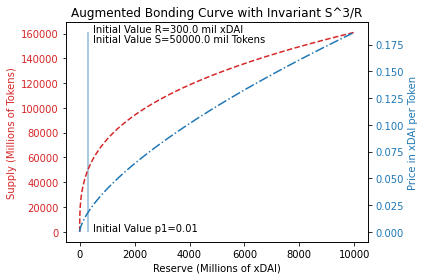

# Creating an augmented bonding curve

Throughout this tutorial, some knowledge around [Augmented Bonding Curves](https://medium.com/giveth/deep-dive-augmented-bonding-curves-3f1f7c1fa751) will be assumed.

## Contents

- [Bond Configuration](#bond-configuration)
- [Bond Creation](#bond-creation)

## Bond Configuration

### Curve Function

In this tutorial, an augmented function bond will be created. The augmented function implemented by the Bonds module can be represented by the below formulas [\[ref\]](https://medium.com/giveth/deep-dive-augmented-bonding-curves-3f1f7c1fa751):

- Initial reserve:
  
- Initial supply:
  
- Constant power function invariant:
  
- Invariant function:
  
- Pricing function:
  
- Reserve function:
  

From all of the above formulas, the four constants that we need to come up with ourselves are:
- `d0`: the total initial raise of reserve tokens, which will be split between the initial reserve `R0` and the initial funding `theta * d0`
- `p0`: the fixed price per token during the hatch phase, used to determine the initial supply `S0`
- `theta`: the initial allocation (as a percentage of initial raise `d0`), i.e. the percentage allocated directly to the funding pool (a.k.a fee address)
- `kappa`: a polynomial degree representing the steepness of the price curve

In this tutorial, the values picked will be: `d0=500.0`, `p0=0.01`, `theta=0.4`, `kappa=3.0`, which gives us the below curve.



Generated using: https://github.com/BlockScience/cadCAD-Tutorials/tree/master/00-Reference-Mechanisms/01-augmented-bonding-curve

### Fees

In this tutorial, the transaction fee percentage will be set to `0%`, the main reason being that the augmented function has an integrated fee percentage `theta` for the hatch phase. The exit fee percentage will be `0.1%`

### Outcome Payment

The outcome payment is an optional (non-enforceable) promise that the bond creator makes to investors specified in terms of a token amount. This is the amount that will need to be deposited into the bond to transition it from the `OPEN` state to the `SETTLE` state, once the goals of the bond have been reached as a result of the reserve token funding that the bond received.

This new reserve will be immediately available to all bond token holders, and the amount available to each holder depends on the amount of bond tokens that they hold. In the case of this tutorial, this will be set to `100000res`.

### Other Customisation

Other customisation options that this tutorial will not go into is the ability to disable sells (burns), and the ability to have multiple signers as the creators/editors of the bond. In this tutorial, sells will be enabled, and the signer will be set to the address underlying the `shaun` account (created when running `make run_with_data`).

Additionally, sanity rate and sanity margin percentage only apply to swapper functions and so they will not be discussed. In this tutorial, these were thus just set to `0`.

## Bond Creation

The bond, with the above configurations, can be created as follows:

```bash
SHAUNADDR="$(bondscli keys show shaun -a)"
FEEADDR="$(bondscli keys show fee -a)"

bondscli tx bonds create-bond \
  --token=demo \
  --name="My Bond" \
  --description="Description about my bond" \
  --function-type=augmented_function \
  --function-parameters="d0:500.0,p0:0.01,theta:0.4,kappa:3.0" \
  --reserve-tokens=stake \
  --tx-fee-percentage=0 \
  --exit-fee-percentage=0.1 \
  --fee-address="$FEEADDR" \
  --max-supply=1000000demo \
  --order-quantity-limits="" \
  --sanity-rate="0" \
  --sanity-margin-percentage="0" \
  --allow-sells \
  --signers="$SHAUNADDR" \
  --batch-blocks=1 \
  --outcome-payment="100000res" \
  --from shaun \
  --keyring-backend=test \
  --broadcast-mode block \
  --gas-prices=0.025stake \
  -y
```

The created bond can be queried using `bondscli q bonds bond demo`, which should return the following, but with different addresses:

```bash
{
  "type": "bonds/Bond",
  "value": {
    "token": "demo",
    "name": "My Bond",
    "description": "Description about my bond",
    "creator": "cosmos1ew5xdhcpamfex0qqu0h8usmek4e3nnc8sm27jc",
    "function_type": "augmented_function",
    "function_parameters": [
      {
        "param": "theta",
        "value": "0.400000000000000000"
      },
      {
        "param": "kappa",
        "value": "3.000000000000000000"
      },
      {
        "param": "d0",
        "value": "500.000000000000000000"
      },
      {
        "param": "p0",
        "value": "0.010000000000000000"
      },
      {
        "param": "R0",
        "value": "300.000000000000000000"
      },
      {
        "param": "S0",
        "value": "50000.000000000000000000"
      },
      {
        "param": "V0",
        "value": "416666666666.666666666666666667"
      }
    ],
    "reserve_tokens": [
      "stake"
    ],
    "tx_fee_percentage": "0.000000000000000000",
    "exit_fee_percentage": "0.100000000000000000",
    "fee_address": "cosmos1g9caxdsgqj2060lp4fjx533svax57v9alv8qc4",
    "max_supply": {
      "denom": "demo",
      "amount": "1000000"
    },
    "order_quantity_limits": [],
    "sanity_rate": "0.000000000000000000",
    "sanity_margin_percentage": "0.000000000000000000",
    "current_supply": {
      "denom": "demo",
      "amount": "0"
    },
    "current_reserve": [],
    "allow_sells": false,
    "signers": [
      "cosmos1ew5xdhcpamfex0qqu0h8usmek4e3nnc8sm27jc"
    ],
    "batch_blocks": "1",
    "outcome_payment": [
      {
        "denom": "res",
        "amount": "100000"
      }
    ],
    "state": "HATCH"
  }
}
```

Note that some extra fields that we did not input ourselves are present. Some of these were discussed in previous tutorials. However, note that in the case of the augmented function:
- the function parameters were extended to include newly calculated values `R0`, `S0`, and `V0`, which are based on the formulae presented in the [Curve Function](#curve-function)
- the intial state is actually `HATCH`, representing the hatch phase, rather than `OPEN`
